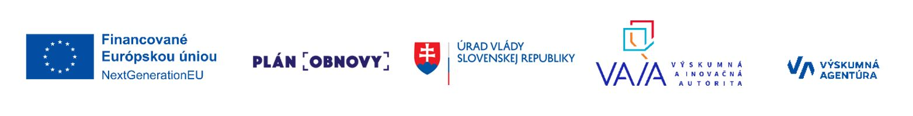

# Petriflow

**Next-generation low code language working with object-centric processes based on Petri nets.**

Petriflow is a low-code / workflow / process-oriented modeling and execution language (and associated toolset) built on
the theory of Petri nets.

Petriflow process consists of a workflow model, roles, data and actions.

## Workflow

As a workflow model, Petriflow uses place/transition Petri nets enriched by reset arcs, inhibitor arcs and read arcs.
Transitions of Petri nets represent tasks of workflow models.

## Roles

Roles layer defines who can execute tasks.

## Data variables

Data variables represent all attributes of a process instance called case during its life-cycle.
Data variables associated to workflow tasks define data fields and create task forms.

## Actions

Actions are pieces of Groovy code that define reactions to events on tasks (assign event, finish event, cancel event)
and events on data fields.
In actions, events can be triggered and external functions can be called.
Workflow model, roles, data variables and data fields defining task forms are stored in XML.

## Use Cases & Advantages

- Good fit when you need workflow / process automation systems where business logic is central.
- Because of its formal Petri net basis, you can reason about concurrency, synchronization, conflicts, deadlocks more
  rigorously than ad hoc workflow models.
- It allows mixing low-code modeling (for business users) with deeper customizations (via actions/code) when needed.
- Models are not just artifacts but become executable applications.

## Learn more

You can also try to build your own application in publicly available [Application builder](https://builder.netgrif.com)
and then deploy it to [Application Engine](https://netgrif.com/products/#nae).

---

Petriflow language is a part of the research project **Requirements and formal definition of a low-code language based
on
object-centric processes** -
[LowcodeOCP](https://vvi.gov.sk/podporene-projekty/requirements-and-formal-definition-of-a-low-code-language-based-on-object-centric-processes).

The research project is funded by the EU NextGenerationEU through the Recovery and Resilience Plan for Slovakia under
the project No. 09I03-03-V04-00493

